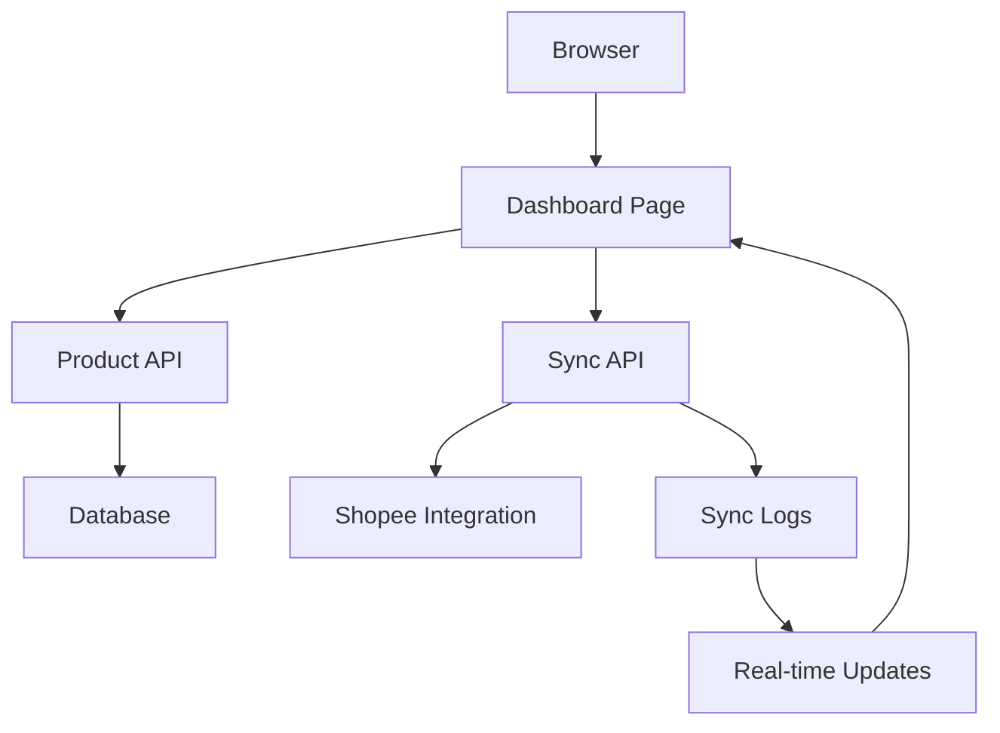

# Design Document - SyncStore Frontend Sprint

## Overview

The SyncStore Frontend Sprint implements a comprehensive dashboard interface that enables business owners to manage product synchronization between their master database and Shopee platform. The design prioritizes real-world usability, clear feedback mechanisms, and browser-testable functionality without requiring technical expertise.

## Architecture

### Frontend Architecture
```
Next.js App Router Structure:
├── src/app/dashboard/products/page.tsx (Main Dashboard)
├── src/app/api/products/route.ts (Product List API)
├── src/app/api/sync/product/route.ts (Individual Sync API)
├── src/app/api/sync/logs/[sync_id]/route.ts (Sync Logs API)
├── src/components/dashboard/ (Dashboard Components)
├── src/hooks/ (Custom React Hooks)
└── src/lib/ (Utilities and Database)
```

### Data Flow


## Components and Interfaces

### Core Components

#### ProductDashboard
- **Purpose**: Main container component for the product management interface
- **Props**: None (fetches data internally)
- **State**: Products list, pagination, loading states
- **Responsibilities**: Layout, data fetching coordination, error boundaries

#### ProductTable
- **Purpose**: Displays paginated product list with sync controls
- **Props**: `products[]`, `onSync`, `loading`, `pagination`
- **Features**: Sortable columns, responsive design, status indicators
- **Integration**: shadcn/ui Table components

#### SyncButton
- **Purpose**: Individual product sync trigger with state management
- **Props**: `productId`, `currentStatus`, `onSync`
- **States**: Idle, Loading, Success (3s), Error
- **Visual**: Dynamic button text, spinner, color changes

#### StatusBadge
- **Purpose**: Visual status indicator for sync state
- **Props**: `status`, `timestamp`, `error`
- **Variants**: 
  - Pending (gray)
  - Syncing (yellow + spinner)
  - Synced (green + timestamp)
  - Error (red + tooltip)

#### SyncLogDrawer
- **Purpose**: Expandable real-time sync event viewer
- **Props**: `syncId`, `isOpen`, `onClose`
- **Features**: Auto-scroll, event filtering, polling management
- **Integration**: shadcn/ui Drawer/Sheet

#### ProgressBar
- **Purpose**: Global sync progress indicator
- **Props**: `current`, `total`, `isActive`
- **Behavior**: Shows/hides based on active sync operations

### API Interfaces

#### GET /api/products
```typescript
interface ProductsResponse {
  products: Product[];
  total: number;
  page: number;
  limit: number;
}

interface Product {
  id: string;
  title: string;
  base_price: number;
  shopee_price: number;
  status: 'pending' | 'syncing' | 'synced' | 'error';
  last_synced_at: string | null;
  last_sync_error: string | null;
}
```

#### POST /api/sync/product
```typescript
interface SyncRequest {
  product_id: string;
  target: 'shopee';
}

interface SyncResponse {
  sync_id: string;
  status: 'processing' | 'success' | 'error';
  message: string;
  errors?: string[];
}
```

#### GET /api/sync/logs/[sync_id]
```typescript
interface SyncLog {
  sync_id: string;
  product_id: string;
  status: 'running' | 'success' | 'error';
  events: SyncEvent[];
  started_at: string;
  completed_at?: string;
}

interface SyncEvent {
  timestamp: string;
  type: 'info' | 'success' | 'error' | 'warning';
  message: string;
  details?: object;
}
```

## Data Models

### Database Schema Extensions
```sql
-- Add sync tracking columns to existing master_products table
ALTER TABLE master_products ADD COLUMN IF NOT EXISTS sync_status VARCHAR(20) DEFAULT 'pending';
ALTER TABLE master_products ADD COLUMN IF NOT EXISTS last_synced_at TIMESTAMP;
ALTER TABLE master_products ADD COLUMN IF NOT EXISTS last_sync_error TEXT;

-- Create sync_logs table for detailed tracking
CREATE TABLE IF NOT EXISTS sync_logs (
  id UUID PRIMARY KEY DEFAULT gen_random_uuid(),
  sync_id VARCHAR(50) UNIQUE NOT NULL,
  product_id UUID REFERENCES master_products(id),
  status VARCHAR(20) NOT NULL,
  events JSONB DEFAULT '[]',
  started_at TIMESTAMP DEFAULT NOW(),
  completed_at TIMESTAMP,
  created_at TIMESTAMP DEFAULT NOW()
);
```

### Frontend State Management
```typescript
// Product list state
interface ProductState {
  products: Product[];
  loading: boolean;
  error: string | null;
  pagination: {
    page: number;
    limit: number;
    total: number;
  };
}

// Sync operation state
interface SyncState {
  activeSyncs: Map<string, SyncOperation>;
  globalProgress: {
    current: number;
    total: number;
  };
}

interface SyncOperation {
  productId: string;
  syncId: string;
  status: 'loading' | 'success' | 'error';
  message: string;
  startTime: Date;
}
```

## Error Handling

### Error Categories and User Messages
```typescript
const ERROR_MESSAGES = {
  'SHOPEE_RATE_LIMIT': {
    user: 'Too many requests. Please wait 5 minutes and try again.',
    technical: '429 Too Many Requests from Shopee API'
  },
  'INVALID_PRODUCT_DATA': {
    user: 'Product information is incomplete. Please check required fields.',
    technical: 'Missing required fields: title, price, or images'
  },
  'CONNECTION_TIMEOUT': {
    user: 'Connection timeout. Please check your internet connection.',
    technical: 'Request timeout after 30 seconds'
  },
  'SHOPEE_API_ERROR': {
    user: 'Shopee service temporarily unavailable. Please try again later.',
    technical: 'Shopee API returned 5xx error'
  }
};
```

### Error Handling Strategy
1. **Immediate Feedback**: Toast notifications for all user actions
2. **Progressive Disclosure**: Basic message + expandable details
3. **Actionable Guidance**: Retry buttons for recoverable errors
4. **Persistent Logging**: All errors logged for debugging
5. **Graceful Degradation**: UI remains functional during partial failures

## Testing Strategy

### Browser Testing Approach
1. **Real Data Verification**: All features tested with actual database content
2. **Network Monitoring**: DevTools Network tab verification for API calls
3. **Console Cleanliness**: Zero errors/warnings in browser console
4. **Responsive Testing**: Mobile and desktop layout verification
5. **User Journey Testing**: Complete workflows from owner perspective

### Testing Checklist per Task
- **Task 1**: Product list loads with real data, pagination works
- **Task 2**: Sync button triggers API, shows loading/success/error states
- **Task 3**: Status badges display correctly, timestamps update
- **Task 4**: Progress bar shows during sync, logs update in real-time
- **Task 5**: Error messages are clear, retry functionality works
- **Task 6**: Batch sync completes successfully, Shopee verification possible
- **Task 7**: All code is production-ready, no dummy implementations

### Performance Requirements
- **Page Load**: < 2 seconds for product list
- **API Response**: < 1 second for sync initiation
- **Batch Sync**: 10 products in < 2 minutes
- **Real-time Updates**: Log polling every 500ms during active sync
- **Memory Usage**: No memory leaks during extended use

## Implementation Phases

### Phase 1: Core Dashboard (Tasks 1-2)
- Product list with real data
- Basic sync functionality
- Toast notifications

### Phase 2: Status & Monitoring (Tasks 3-4)
- Status tracking and display
- Progress indicators
- Real-time log viewer

### Phase 3: Error Handling & Testing (Tasks 5-7)
- Comprehensive error handling
- Batch operations
- Production readiness verification

## Security Considerations

- **API Authentication**: Verify user permissions for sync operations
- **Input Validation**: Sanitize all user inputs and API parameters
- **Rate Limiting**: Implement client-side rate limiting for API calls
- **Error Information**: Avoid exposing sensitive system details in error messages
- **CSRF Protection**: Ensure all state-changing operations are protected

## Browser Compatibility

- **Primary**: Chrome, Firefox, Safari (latest 2 versions)
- **Mobile**: iOS Safari, Chrome Mobile
- **Features**: ES2020+, CSS Grid, Flexbox
- **Fallbacks**: Graceful degradation for older browsers
- **Testing**: Cross-browser verification for critical paths