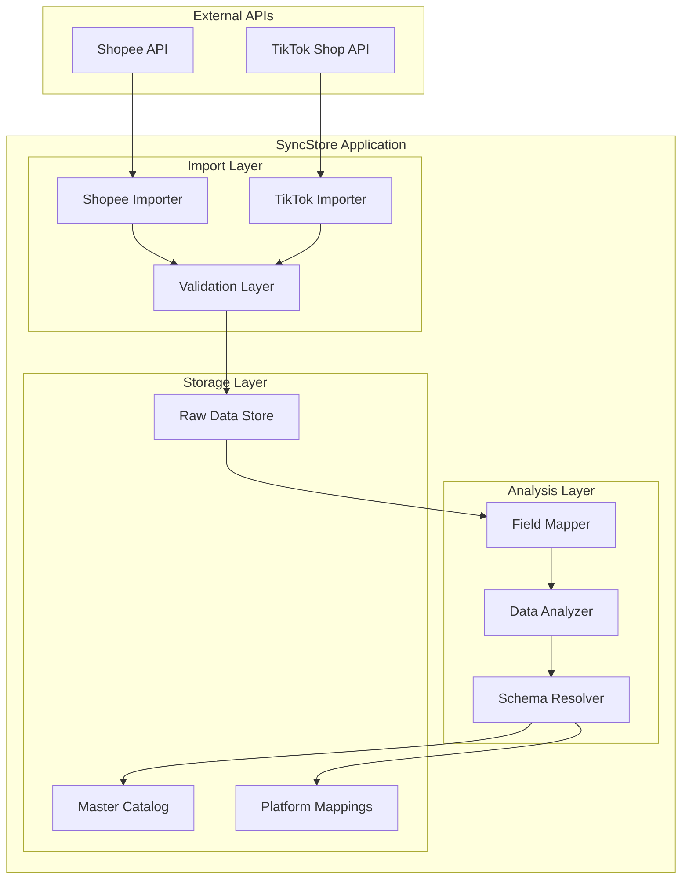
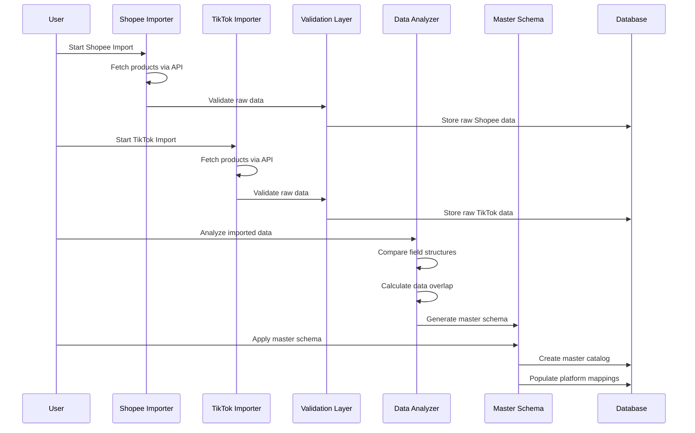

# Design Document

## Overview

SyncStore Phase 1 implements a comprehensive data import and master schema design system for multi-platform e-commerce management. The system will import approximately 500 products from Shopee and TikTok Shop APIs, analyze field structures to identify commonalities and differences, then design and implement a unified master catalog schema that serves as the single source of truth for future synchronization operations.

The design follows a data-driven approach where real imported data informs the master schema design, ensuring the solution accommodates actual business needs rather than theoretical requirements.

## Architecture

### High-Level Architecture



### Data Flow Architecture



## Components and Interfaces

### 1. Data Import Components

#### Shopee Importer
```typescript
interface ShopeeImporter {
  // Core import functionality
  importProducts(): Promise<ImportResult>;
  fetchProductList(offset: number, limit: number): Promise<ShopeeProduct[]>;
  fetchProductDetails(itemIds: string[]): Promise<ShopeeProductDetail[]>;
  
  // Pagination and rate limiting
  handlePagination(totalCount: number): Promise<void>;
  implementRateLimit(): Promise<void>;
  
  // Error handling
  retryWithBackoff(operation: () => Promise<any>, maxRetries: number): Promise<any>;
}

interface ShopeeProduct {
  item_id: string;
  item_name: string;
  description: string;
  images: string[];
  price: number;
  weight: number;
  dimensions: {
    length: number;
    width: number;
    height: number;
  };
  category_id: string;
  models: ShopeeVariant[];
}
```

#### TikTok Shop Importer
```typescript
interface TikTokImporter {
  // Core import functionality
  importProducts(): Promise<ImportResult>;
  fetchProducts(page: number, pageSize: number): Promise<TikTokProduct[]>;
  
  // Tokopedia integration
  handleTokopediaFlag(product: TikTokProduct): boolean;
  
  // Error handling
  retryWithBackoff(operation: () => Promise<any>, maxRetries: number): Promise<any>;
}

interface TikTokProduct {
  product_id: string;
  product_name: string;
  description: string;
  images: TikTokImage[];
  price: number;
  weight: number;
  dimensions: ProductDimensions;
  category_id: string;
  include_tokopedia: boolean;
  variants: TikTokVariant[];
}
```

### 2. Data Analysis Components

#### Field Mapper
```typescript
interface FieldMapper {
  // Field analysis
  analyzeCommonFields(shopeeData: ShopeeProduct[], tiktokData: TikTokProduct[]): CommonFieldMap;
  identifyPlatformSpecificFields(): PlatformSpecificFields;
  calculateDataOverlap(): OverlapAnalysis;
  
  // Mapping generation
  generateFieldMappings(): FieldMappingDocument;
  validateMappingCompleteness(): ValidationResult;
}

interface CommonFieldMap {
  title: FieldMapping;
  description: FieldMapping;
  images: FieldMapping;
  price: FieldMapping;
  weight: FieldMapping;
  dimensions: FieldMapping;
  category: FieldMapping;
  variants: FieldMapping;
}

interface FieldMapping {
  shopeeField: string;
  tiktokField: string;
  dataType: string;
  required: boolean;
  transformationNeeded: boolean;
}
```

#### Data Analyzer
```typescript
interface DataAnalyzer {
  // Statistical analysis
  calculateProductOverlap(shopeeProducts: ShopeeProduct[], tiktokProducts: TikTokProduct[]): OverlapStats;
  analyzeVariantStructures(): VariantAnalysis;
  validateDataQuality(): QualityReport;
  
  // Reporting
  generateAnalysisReport(): AnalysisReport;
  identifyDataInconsistencies(): InconsistencyReport;
}

interface OverlapStats {
  totalShopeeProducts: number;
  totalTikTokProducts: number;
  commonProducts: number;
  overlapPercentage: number;
  shopeeOnlyProducts: string[];
  tiktokOnlyProducts: string[];
}
```

### 3. Master Schema Components

#### Schema Designer
```typescript
interface SchemaDesigner {
  // Schema generation
  designMasterSchema(fieldMappings: FieldMappingDocument): MasterProductSchema;
  createPlatformMappings(): PlatformMappingSchema;
  generatePricingLogic(): PricingConfiguration;
  
  // SEO optimization
  createSEOTitleStrategy(): SEOTitleConfig;
  generateTitleVariations(baseTitle: string): PlatformTitles;
}

interface MasterProductSchema {
  // Universal fields
  id: string;
  sku: string;
  title: string;
  description: string;
  images: ProductImage[];
  basePrice: number;
  cost: number;
  weight: number;
  dimensions: ProductDimensions;
  category: string;
  tags: string[];
  
  // Variants
  variants: ProductVariant[];
  
  // Platform mappings
  platformMappings: {
    shopee?: ShopeePlatformMapping;
    tiktokshop?: TikTokPlatformMapping;
    website?: WebsitePlatformMapping;
  };
  
  // Metadata
  status: 'active' | 'inactive' | 'archived';
  createdAt: Date;
  updatedAt: Date;
}
```

### 4. Validation Components

#### Data Validator
```typescript
interface DataValidator {
  // Product validation
  validateProduct(product: any): ValidationResult;
  validateRequiredFields(product: any): FieldValidationResult[];
  validatePricing(price: number): boolean;
  validateImages(images: string[]): ImageValidationResult[];
  
  // Batch validation
  validateBatch(products: any[]): BatchValidationResult;
  generateValidationReport(): ValidationReport;
}

interface ValidationResult {
  isValid: boolean;
  errors: ValidationError[];
  warnings: ValidationWarning[];
}
```

## Data Models

### Master Product Model

```typescript
interface MasterProduct {
  // Core identification
  id: string; // UUID
  sku: string; // Master SKU (e.g., "FRAME-5IN")
  
  // Universal product data
  title: string; // "Frame Racing 5 Inch Carbon Fiber"
  shortDescription: string; // One-line summary
  fullDescription: string; // Detailed description
  
  // Pricing
  basePrice: number; // Master price without platform fees
  costPrice: number; // For margin calculation
  currency: 'IDR';
  
  // Physical specifications
  weight: number; // in kg
  dimensions: {
    length: number; // cm
    width: number; // cm
    height: number; // cm
  };
  
  // Media
  images: ProductImage[];
  
  // Categorization
  category: string; // "drone_parts"
  subcategory: string; // "frames"
  tags: string[]; // ["5inch", "racing", "carbon"]
  
  // Variants (if applicable)
  variants: ProductVariant[];
  
  // Platform-specific mappings
  platformMappings: PlatformMappings;
  
  // Metadata
  status: 'active' | 'inactive' | 'archived';
  createdAt: Date;
  updatedAt: Date;
}

interface ProductImage {
  url: string;
  alt: string;
  position: number;
  primary: boolean;
}

interface ProductVariant {
  variantId: string;
  variantSku: string; // "FRAME-5IN-RED"
  name: string; // "Color: Red"
  attributes: Record<string, string>; // {color: "Red", material: "Carbon"}
  priceOverride?: number; // If variant has different price
  images?: ProductImage[];
}

interface PlatformMappings {
  shopee?: ShopeePlatformMapping;
  tiktokshop?: TikTokPlatformMapping;
  website?: WebsitePlatformMapping;
}
```

### Platform Mapping Models

```typescript
interface ShopeePlatformMapping {
  syncEnabled: boolean;
  itemId: string; // Shopee item_id
  shopId: string; // Shopee shop_id
  categoryId: string; // Shopee category_id
  
  // Pricing
  pricing: {
    platformFeePercentage: number; // 15
    paymentFeePercentage: number; // 2.9
    calculatedPrice: number; // basePrice * 1.15
  };
  
  // SEO optimization
  seoOptimization: {
    platformTitle: string; // SEO-optimized title for Shopee
    titleKeywords: string[];
  };
  
  // Shipping
  shipping: {
    shippingTemplateId: string;
    couriers: string[];
    preorderDays: number;
    preorderDescription: string;
  };
  
  // Variants
  variants: ShopeeVariantMapping[];
  
  // Sync status
  syncStatus: 'pending' | 'synced' | 'error';
  lastSyncedAt?: Date;
  syncErrors?: string[];
}

interface TikTokPlatformMapping {
  syncEnabled: boolean;
  productId: string; // TikTok product_id
  shopId: string; // TikTok shop_id
  categoryId: string; // TikTok category_id
  includeTokopedia: boolean; // Auto-sync to Tokopedia
  
  // Pricing
  pricing: {
    platformFeePercentage: number; // 20
    paymentFeePercentage: number; // 2.5
    calculatedPrice: number; // basePrice * 1.20
  };
  
  // SEO optimization
  seoOptimization: {
    platformTitle: string; // SEO-optimized title for TikTok
    titleKeywords: string[];
  };
  
  // Tokopedia info
  tokopediaInfo?: {
    enabled: boolean;
    tokopediaProductId: string;
    tokopediaCategoryId: string;
    syncedAt: Date;
  };
  
  // Variants
  variants: TikTokVariantMapping[];
  
  // Sync status
  syncStatus: 'pending' | 'synced' | 'error';
  lastSyncedAt?: Date;
  syncErrors?: string[];
}
```

## Error Handling

### Error Classification

```typescript
enum ImportErrorType {
  API_CONNECTION_ERROR = 'api_connection_error',
  AUTHENTICATION_ERROR = 'authentication_error',
  RATE_LIMIT_ERROR = 'rate_limit_error',
  DATA_VALIDATION_ERROR = 'data_validation_error',
  PARSING_ERROR = 'parsing_error',
  STORAGE_ERROR = 'storage_error'
}

interface ImportError {
  type: ImportErrorType;
  message: string;
  productId?: string;
  timestamp: Date;
  retryable: boolean;
  context?: Record<string, any>;
}
```

### Error Handling Strategy

1. **API Errors**: Implement exponential backoff with jitter
2. **Rate Limiting**: Respect platform limits with automatic throttling
3. **Data Validation**: Continue processing, log errors for manual review
4. **Network Issues**: Retry with increasing delays
5. **Critical Errors**: Stop processing, preserve data integrity

### Retry Logic

```typescript
interface RetryConfig {
  maxRetries: number; // 3
  baseDelay: number; // 1000ms
  maxDelay: number; // 30000ms
  backoffMultiplier: number; // 2
  jitterEnabled: boolean; // true
}
```

## Testing Strategy

### Unit Testing

1. **Import Components**
   - Test API integration with mock responses
   - Validate pagination handling
   - Test error scenarios and retry logic

2. **Data Analysis Components**
   - Test field mapping accuracy
   - Validate overlap calculations
   - Test schema generation logic

3. **Validation Components**
   - Test all validation rules
   - Test batch processing
   - Test error reporting

### Integration Testing

1. **End-to-End Import Flow**
   - Test complete Shopee import process
   - Test complete TikTok Shop import process
   - Validate data consistency

2. **Database Integration**
   - Test schema migrations
   - Test data persistence
   - Test query performance

### Performance Testing

1. **Import Performance**
   - Measure time to import 500 products
   - Test memory usage during large imports
   - Validate rate limiting effectiveness

2. **Database Performance**
   - Test query performance on large datasets
   - Validate index effectiveness
   - Test concurrent access patterns

### Data Quality Testing

1. **Field Mapping Validation**
   - Verify 90%+ data overlap between platforms
   - Test handling of missing fields
   - Validate data type conversions

2. **Pricing Calculation Testing**
   - Test fee percentage applications
   - Validate currency handling
   - Test variant pricing logic

## Implementation Phases

### Phase 1.1: Environment Setup (Week 1)
- Set up development environment
- Configure API credentials
- Test API connectivity
- Create field mapping analysis

### Phase 1.2: Data Import Implementation (Week 2)
- Implement Shopee importer
- Implement TikTok Shop importer
- Execute full data import
- Generate import reports

### Phase 1.3: Schema Design (Week 3)
- Analyze imported data
- Design master schema
- Implement database migrations
- Populate master catalog

### Phase 1.4: Validation & Testing (Week 4)
- Comprehensive testing
- Data validation
- Performance optimization
- Documentation completion

## Success Criteria

### Primary Success Metrics
- 500+ Shopee products imported successfully
- 500+ TikTok Shop products imported successfully
- 95%+ data validation success rate
- Master schema accommodates all imported data
- Field mapping document complete
- Pricing calculations verified

### Quality Metrics
- Import performance: <30 minutes for 500 products
- Data accuracy: >99% field mapping accuracy
- Error handling: Graceful recovery from all error types
- Documentation: Complete API documentation and troubleshooting guides

### Business Value Metrics
- Single source of truth established
- Platform-specific pricing automated
- SEO title variations generated
- Ready for Phase 2 synchronization testing